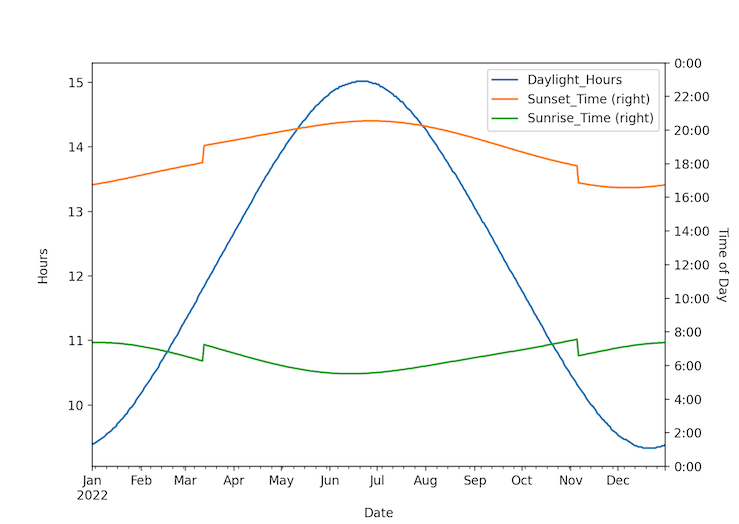

A simple tool to scrape and plot sunrise and sunset data from NOAA's publicly available datasets. Data processing and plotting is done using pandas. The user enters geographic coordinates of their desired location.

This is mostly proof-of-concept & practice with data scraping and plotting, though it will be used and updated in the future. An example graph for Radnor, PA is included below.

